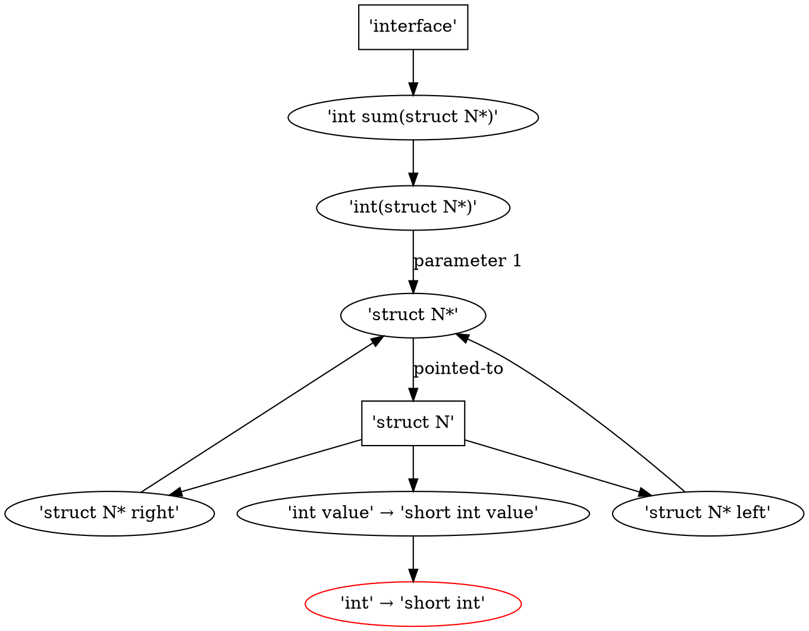

# Tutorial

The simplest use for the STG tools is to extract, store and compare ABI
representations.

This tutorial uses long options throughout. Equivalent short options can be
found in the manual pages for [`stg`](stg.md) and [`stgdiff`](stgdiff.md). Both
tools understand `-` as a shorthand for `/dev/stdout`.

<details>
<summary>Working Example - code and compilation</summary>

This small code sample will be used as a working example. Copy it into a file
called `tree.c`.

```c
struct N {
  struct N * left;
  struct N * right;
  int value;
};

unsigned int count(struct N * tree) {
  return tree ? count(tree->left) + count(tree->right) + 1 : 0;
}

int sum(struct N * tree) {
  return tree ? sum(tree->left) + sum(tree->right) + tree->value : 0;
}
```

Compile it:

```shell
gcc -Wall -Wextra -g -c tree.c -o tree.o
```

</details>

## Extraction from ELF / DWARF

`stg` is the tool for extracting ABI representations, though it can do more
sophisticated things as well. The simplest invocation of `stg` looks something
like this:

```shell
stg --elf library.so --output library.stg
```

Adding the `--annotate` option can be useful, especially if trying to debug ABI
issues or when experimenting with the tools, like now.

If the output consists of just symbols and you get a warning about missing DWARF
information, this means that `library.so` has no DWARF debugging information.
For meaningful results, `stg` should be run on an *unstripped* ELF file which
may require build system adjustments.

<details>
<summary>Working Example - ABI extraction</summary>

Run this:

```shell
stg --elf tree.o --annotate --output -
```

And you should get something like this:

<details>
<summary>Output</summary>

```proto
version: 0x00000002
root_id: 0x84ea5130  # interface
pointer_reference {
  id: 0x32b38621
  kind: POINTER
  pointee_type_id: 0xe08efe1a  # struct N
}
primitive {
  id: 0x4585663f
  name: "unsigned int"
  encoding: UNSIGNED_INTEGER
  bytesize: 0x00000004
}
primitive {
  id: 0x6720d32f
  name: "int"
  encoding: SIGNED_INTEGER
  bytesize: 0x00000004
}
member {
  id: 0x35cbdb23
  name: "left"
  type_id: 0x32b38621  # struct N*
}
member {
  id: 0x0b440ffb
  name: "right"
  type_id: 0x32b38621  # struct N*
  offset: 64
}
member {
  id: 0xa06f75d5
  name: "value"
  type_id: 0x6720d32f  # int
  offset: 128
}
struct_union {
  id: 0xe08efe1a
  kind: STRUCT
  name: "N"
  definition {
    bytesize: 24
    member_id: 0x35cbdb23  # struct N* left
    member_id: 0x0b440ffb  # struct N* right
    member_id: 0xa06f75d5  # int value
  }
}
function {
  id: 0x912c02a7
  return_type_id: 0x6720d32f  # int
  parameter_id: 0x32b38621  # struct N*
}
function {
  id: 0xc2779f73
  return_type_id: 0x4585663f  # unsigned int
  parameter_id: 0x32b38621  # struct N*
}
elf_symbol {
  id: 0xbb237197
  name: "count"
  is_defined: true
  symbol_type: FUNCTION
  type_id: 0xc2779f73  # unsigned int(struct N*)
  full_name: "count"
}
elf_symbol {
  id: 0x4fdeca38
  name: "sum"
  is_defined: true
  symbol_type: FUNCTION
  type_id: 0x912c02a7  # int(struct N*)
  full_name: "sum"
}
interface {
  id: 0x84ea5130
  symbol_id: 0xbb237197  # unsigned int count(struct N*)
  symbol_id: 0x4fdeca38  # int sum(struct N*)
}
```

</details>

</details>

## Filtering

One issue when first starting to manage the ABI of a binary is the wish to
restrict the interface surface to just the necessary minimum. Any superfluous
symbols or type definitions in the ABI representation can result in spurious
ABI differences in reports later on.

When it comes to the symbols exposed, it's common to control symbol
*visibility*. Type definitions can be either exposed in public header files or
hidden in private header files, with perhaps only public forward declarations,
but this does not remove any type definitions in the DWARF information.

STG provides filtering facilities for both symbols and types, for example:

```shell
stg --files '*.h' --elf library.so --output library.stg
```

This will ensure that definitions of any types defined outside any header files,
and perhaps used as opaque pointer handles, are omitted from the ABI
representation. If you separate public and private headers, then use an
appropriate glob pattern that distinguishes the two.

Sets of symbol or file names can be read from a file. In this example, all
symbols whose names begin with `api_`, except those in the `obsolete` file, are
kept.

```shell
stg --symbols 'api_* & ! :obsolete' --elf library.so --output library.stg
```

For historical reasons, the literal filter file format is compatible with
libabigail's symbol list one, but this is subject to change.

```ini
[list]
 # one symbol per line
 foo # comments, whitespace and empty lines are all ignored
 bar

 baz
```

<details>
<summary>Working Example - filtering the ABI</summary>

Let's say that `struct N` is supposed to be an opaque type that user code only
gets pointers to and, additionally, the function `count` should be excluded from
the ABI (perhaps due to an argument over its return type). We can exclude the
definition of `struct N`, along with that of any other types defined in
`tree.c`, using a file filter. The symbol can be excluded by name.

Run this:

```shell
stg --elf tree.o --files '*.h' --symbols '!count' --output -
```

The result should be something like this:

<details>
<summary>Output</summary>

```proto
version: 0x00000002
root_id: 0x84ea5130
pointer_reference {
  id: 0x26944aa7
  kind: POINTER
  pointee_type_id: 0xb011cc02
}
primitive {
  id: 0x6720d32f
  name: "int"
  encoding: SIGNED_INTEGER
  bytesize: 0x00000004
}
struct_union {
  id: 0xb011cc02
  kind: STRUCT
  name: "N"
}
function {
  id: 0x9425f186
  return_type_id: 0x6720d32f
  parameter_id: 0x26944aa7
}
elf_symbol {
  id: 0x4fdeca38
  name: "sum"
  is_defined: true
  symbol_type: FUNCTION
  type_id: 0x9425f186
  full_name: "sum"
}
interface {
  id: 0x84ea5130
  symbol_id: 0x4fdeca38
}
```

</details>

</details>

## ABI Comparison

`stgdiff` is the tool for comparing ABI representations and reporting
differences, though it has some other, more specialised, uses. The simplest
invocation of `stgdiff` looks something like this:

```shell
stgdiff --stg old/library.stg new/library.stg --output -
```

This will report ABI differences in the default (`small`) format.

<details>
<summary>Working Example - ABI differences - small format</summary>

The function `sum` has a type that depends on `struct N`. Any change to either
might affect the ABI exposed via `sum`. For example, if the type of the `value`
member is changed to `short` and the file is recompiled, STG can detect this
difference.

First rerun the STG extraction, specifying `--output tree-old.stg`. Make the
source code change, recompile and extract the ABI with `--output tree-new.stg`.

Then run this:

```shell
stgdiff --stg tree-old.stg tree-new.stg --output -
```

To get this:

```text
type 'struct N' changed
  member changed from 'int value' to 'short int value'
    type changed from 'int' to 'short int'

```

</details>

The `small` format omits parts of the ABI graph which haven't changed.[^1] To
see all impacted nodes, use `--format flat` instead.

[^1]: The similarly named `short` format goes a bit further and will omit and
    summarise certain repetitive differences.

<details>
<summary>Working Example - ABI differences - flat format</summary>

```text
function symbol 'int sum(struct N*)' changed
  type 'int(struct N*)' changed
    parameter 1 type 'struct N*' changed
      pointed-to type 'struct N' changed

type 'struct N' changed
  member 'struct N* left' changed
    type 'struct N*' changed
      pointed-to type 'struct N' changed
  member 'struct N* right' changed
    type 'struct N*' changed
      pointed-to type 'struct N' changed
  member changed from 'int value' to 'short int value'
    type changed from 'int' to 'short int'

```

</details>

And if you really want to see more of the graph structure, use `--format plain`.

<details>
<summary>Working Example - ABI differences - plain format</summary>

```text
function symbol 'int sum(struct N*)' changed
  type 'int(struct N*)' changed
    parameter 1 type 'struct N*' changed
      pointed-to type 'struct N' changed
        member 'struct N* left' changed
          type 'struct N*' changed
            pointed-to type 'struct N' changed
              (being reported)
        member 'struct N* right' changed
          type 'struct N*' changed
            pointed-to type 'struct N' changed
              (being reported)
        member changed from 'int value' to 'short int value'
          type changed from 'int' to 'short int'

```

</details>

Or just use `--format viz` which generates input for
[Graphviz](https://graphviz.org/).

<details>
<summary>Working Example - ABI differences - viz format</summary>



</details>
